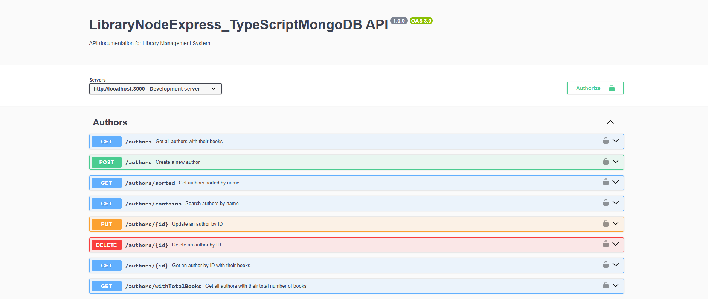
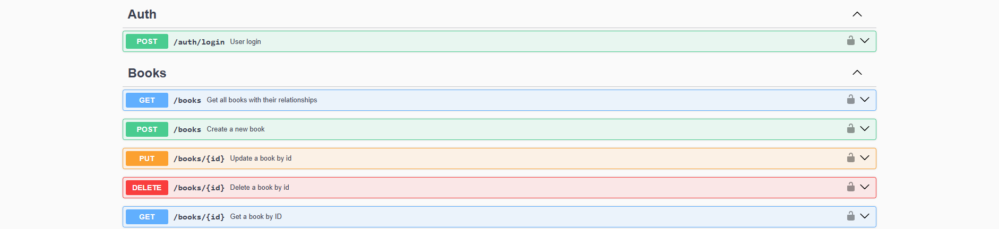
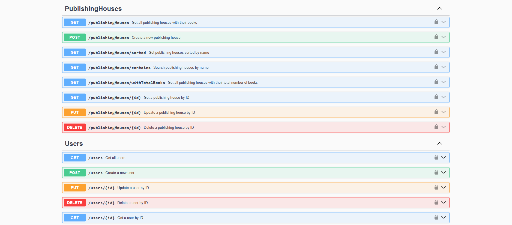

## LibraryNodeExpress_TypeScriptMongoDB

**LibraryNodeExpress_TypeScriptMongoDB** is an NodeJS + Express API that manages library-related information, including authors, books, and publishing houses, as well as handling user authentication and logging actions performed on the system.

LibraryNodeExpress_TypeScriptMongoDB/  
├── src/    
│   ├── controllers/   
│   │      ├── authController.ts   
│   │      ├── authorController.ts  
│   │      ├── bookController.ts  
│   │      ├── publishingHouseController.ts  
│   │      └── userController.ts  
│   ├── db/   
│   │      └── conection.ts   
│   ├── models/  
│   │      ├── authorModel.ts   
│   │      ├── bookModel.ts  
│   │      ├── publishingHouseModel.ts  
│   │      └── userModel.ts  
│   ├── routes/   
│   │      ├── authRoutes.ts   
│   │      ├── authorRoutes.ts  
│   │      ├── bookRoutes.ts  
│   │      ├── publishingHouseRoutes.ts  
│   │      └── userRoutes.ts  
│   ├── app.ts  
│   └── index.ts   
├── .env  
├── package.json  
├── tsconfig.json

## connection.ts
```ts 
export const connectDB = async () => {
  try {
    const mongoURI =
      process.env.MONGODB_URI || "mongodb://localhost:27017/Library";
    await mongoose.connect(mongoURI);
    console.log("MongoDB Connected...");
  } catch (err) {
    console.error("MongoDB connection error:", err);
    process.exit(1);
  }
};
``` 





[DeepWiki moraisLuismNet/LibraryNodeExpress_TypeScriptMongoDB](https://deepwiki.com/moraisLuismNet/LibraryNodeExpress_TypeScriptMongoDB)